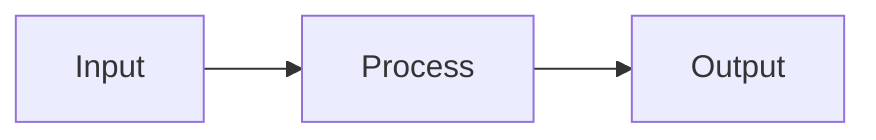
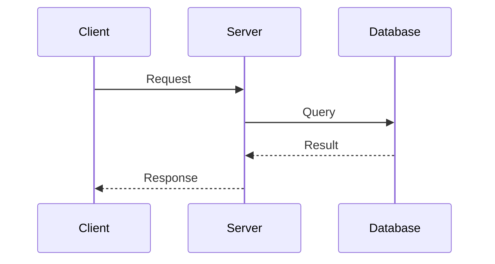

# Notion Explain Diff

Create a comprehensive, well-written Notion page that explains code changes in depth. Designed to help reviewers and future maintainers understand not just what changed, but why and how.

## Quick Start

When asked to explain code changes:

1. **Identify changes**: Get the diff or recent changes
2. **Research context**: Explore surrounding code for background
3. **Create page**: Build comprehensive explanation in Notion
4. **Return link**: Provide URL to the new documentation page

## Input

The user specifies changes to explain:
- Explicit: "Explain the changes in PR #123"
- Implicit: "Explain the changes" (uses recent changes in conversation)
- URL: A Notion task URL to link the explanation to

## Document Structure

### Section 1: Background

```markdown
## Background

### For Beginners
[Deep background on the existing system - can be skipped by experts]

Explain:
- What part of the system this touches
- Key concepts needed to understand the change
- How things worked before

### Direct Context
[Narrower background directly relevant to this change]

Explain:
- The specific area being modified
- Why this code exists
- What problem it solves
```

### Section 2: Intuition

```markdown
## Intuition

[Core insight behind the change - the "aha moment"]

Focus on:
- The essence of the change, not all details
- Why this approach was chosen
- Mental model for understanding

Use:
- Concrete examples with toy data
- Diagrams (Mermaid) liberally
- Analogies where helpful
```

### Section 3: Code Walkthrough

```markdown
## Code Changes

[High-level walkthrough of what changed]

Organize by:
- Logical grouping (not just file order)
- Order that builds understanding

For each group:
- What changed and why
- Key code snippets with explanation
- How it connects to the intuition
```

### Section 4: Verification

```markdown
## Verification

### How It Was Tested
[Explain automated verification]
- Unit tests added/modified
- Integration tests
- Other automated checks

### Manual QA Guide
[Step-by-step for manual testing]
1. Set up test environment
2. Step to reproduce scenario
3. Expected behavior
4. How to verify it works
```

### Section 5: Alternatives (Optional)

```markdown
## Alternatives Considered

Only include if meaningful alternatives exist.

### Alternative A: [Name]
| Pros | Cons |
|------|------|
| ... | ... |

### Alternative B: [Name]
| Pros | Cons |
|------|------|
| ... | ... |

### Why We Chose This Approach
[Brief explanation of the decision]
```

### Section 6: Quiz

```markdown
## Knowledge Check

5 questions to verify understanding (medium difficulty):

1. [Question about the change]
   ▶ Option A
     ❌ Explanation why incorrect
   ▶ Option B
     ❌ Explanation why incorrect
   ▶ Option C
     ✅ Explanation why correct
   ▶ Option D
     ❌ Explanation why incorrect

2. [Next question...]
```

## Writing Style

Write with clarity and flow, following these principles:

### Classic Style
- Clear, direct prose
- Confident but not arrogant
- Focus on making complex things accessible

### Transitions
- Smooth flow between sections
- Each section builds on the previous
- Reader should never feel lost

### Technical Accuracy
- Precise terminology
- Accurate code references
- No hand-waving on important details

## Diagram Guidelines

### Recommended Diagram Types

**System/Data Flow Diagrams**

- Show data flow between components
- Include example data values
- Highlight what changed

**Sequence Diagrams**

- Show interactions between components
- Useful for protocol/API changes

### Diagram Best Practices
- Use a consistent diagram family throughout
- Include example data in diagrams
- Label clearly
- Don't over-complicate

## Notion Formatting

### Use Callouts For
- Key concepts or definitions
- Important edge cases
- Warnings or gotchas
- Tips and best practices

### Use Toggle Blocks For
- Quiz answers
- Optional deep dives
- Lengthy code examples

### Use Tables For
- Comparisons (alternatives, before/after)
- Property listings
- Quick reference information

## Output Format

Create a new Notion page with:

1. **Title**: "Explaining: [Brief Change Description]"
2. **All sections** as described above
3. **Proper formatting** using Notion features
4. **Diagrams** rendered as code blocks (Mermaid)

Return the URL to the created page.

## Example Output Structure

```
📄 Explaining: Authentication Flow Refactor

## Background
### For Beginners
[3-4 paragraphs on auth systems]

### Direct Context
[2-3 paragraphs on our specific auth]

## Intuition
[Core insight with diagram]

## Code Changes
### Token Validation (3 files)
[Explanation + code snippets]

### Session Management (2 files)
[Explanation + code snippets]

## Verification
### Automated Tests
- Added 5 unit tests for token validation
- Modified integration test for login flow

### Manual QA
1. Start the dev server
2. Navigate to /login
3. Enter test credentials
4. Verify redirect to dashboard
5. Check session cookie is set

## Alternatives Considered
[If applicable]

## Knowledge Check
[5 quiz questions with toggle answers]
```

## Best Practices

- **Research thoroughly**: Read surrounding code before writing
- **Explain the "why"**: Don't just describe what changed
- **Use visuals**: Diagrams aid understanding significantly
- **Be engaging**: This is educational content, not dry documentation
- **Test the quiz**: Questions should require actual understanding

## MCP Tools Used

- `Notion:notion-create-pages` - Create the explanation page
- `Notion:notion-update-page` - Add content sections
